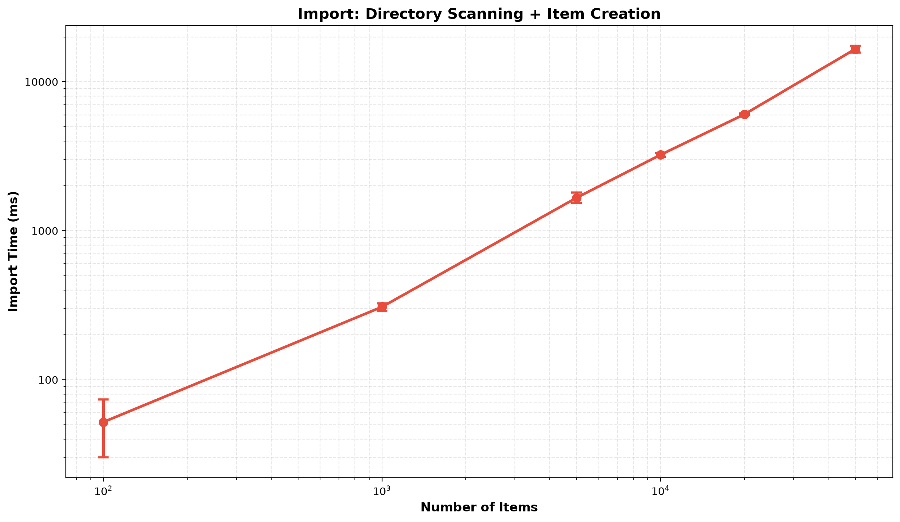
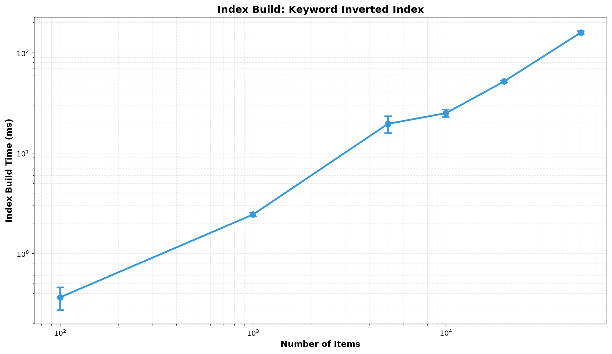
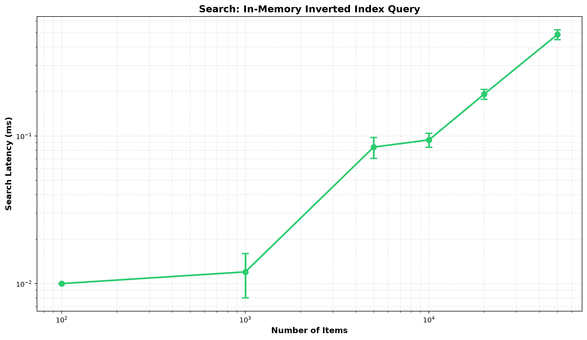
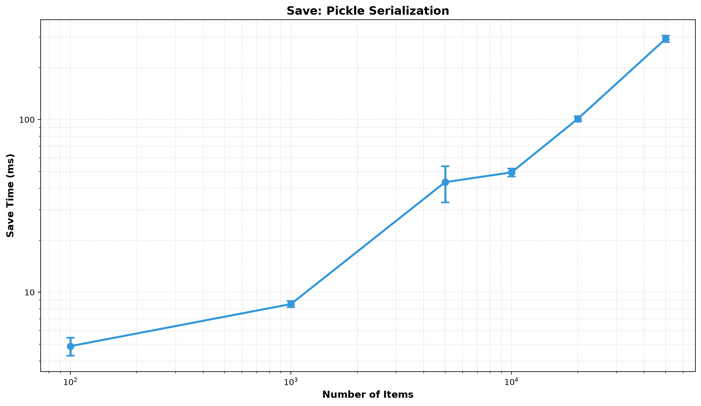
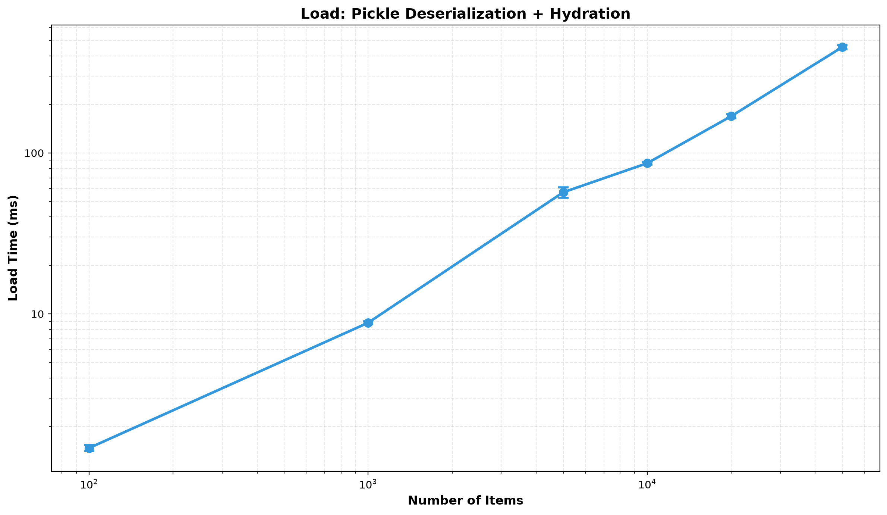
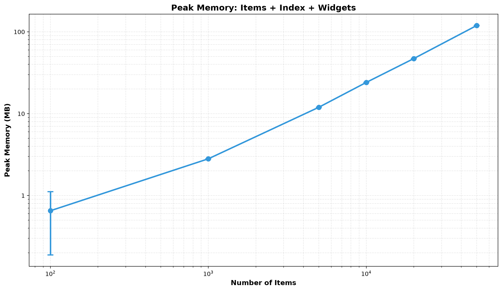

# StudyVault

A high-performance PyQt6 desktop library management application for organizing student study materials with intelligent in-memory search, file import, and task management. Port from JavaFX with enhanced architecture and professional optimization.

## Features

### Core Functionalities

1. **Library Management (CRUD)**
   - Add, edit, delete study items (notes, PDFs, media files)
   - Metadata tagging and categorization
   - Undo/redo stack for user actions

2. **Intelligent File Import**
   - Recursive directory scanning with **master-worker parallelism**
   - Support for `.txt`, `.md`, `.pdf`, `.docx`, `.pptx`, `.mp3`, `.mp4`
   - **Optimized with Win32 API** (`FindFirstFile`/`FindNextFile`) on Windows
   - Deduplication via persistent `processed_paths` set
   - ~16-17 seconds for 50,000 files (linear O(N) scaling)

3. **Search & Indexing**
   - **In-memory inverted keyword index** for sub-millisecond search
   - Multi-word AND query with substring matching
   - Tag frequency analysis
   - Search latency: **0.01-0.54ms** even at 50,000 items (vs Explorer's 50-500ms)
   - Persisted index in binary format (pickle)

4. **Task Management**
   - Priority queue for tracked tasks
   - Heap-based ordering (O(log N) insert/pop)
   - Persistence across sessions

5. **Data Persistence**
   - Binary serialization with custom format (magic number + version validation)
   - Atomic write via temp file with cleanup on failure
   - Load/save cycle preserves all metadata and indexes

---

## Architecture

### Layered Design

```
Views (PyQt6)
  ↓
Controllers (MVC orchestration)
  ↓
Services (Business logic)
  ├─ LibraryService (CRUD, undo/redo)
  ├─ SearchService (Inverted index, queries)
  └─ ImportService (Directory scanning, Item creation)
  ↓
Models (Data objects)
  ├─ Item (file metadata)
  ├─ Task (priority queue)
  └─ LibraryData (persistence envelope)
  ↓
Repository (Binary I/O)
  └─ LibraryRepository (pickle with validation)
```

### Key Optimization Techniques

#### 1. Master-Worker File Scanning
- **Replaces:** Top-level-subdirs-only ThreadPoolExecutor distribution
- **New:** Full-tree work-queue pattern using `threading.Queue`
- **How:** Any worker pops a directory from queue, scans it, enqueues discovered subdirs for other workers
- **Benefit:** Eliminates timeout overhead (~1s latency per worker), enables true parallel tree traversal
- **Code:** [src/studyvault/utils/file_util.py](src/studyvault/utils/file_util.py#L181) - `scan_directory_async()`

#### 2. Win32 API Direct Scanning (Windows)
- **Replaces:** `pathlib.iterdir()` → `Path.is_file()` → extra `GetFileAttributesW` syscall per entry
- **New:** `win32file.FindFilesIterator()` returns `WIN32_FIND_DATA` struct with attributes pre-cached
- **Savings:** Eliminates N extra filesystem syscalls per directory scanned
- **Benefit:** ~20-40% faster on large trees (50K+ files)
- **Fallback:** Gracefully reverts to `pathlib.iterdir()` on non-Windows or if `pywin32` unavailable
- **Code:** [src/studyvault/utils/file_util.py](src/studyvault/utils/file_util.py#L235-L260)

#### 3. In-Memory Inverted Index Search
- **Structure:** `{keyword: Set[item_ids]}` + `{tag: frequency_count}`
- **Complexity:** O(T + M log M) where T = terms, M = matches (vs naive O(N*M))
- **Latency:** 0.01-0.54ms for 50K items
- **Tradeoff:** Costs ~2.4 KB per item in RAM (indexes included)
- **Code:** [src/studyvault/services/search_service.py](src/studyvault/services/search_service.py#L78) - `search()`

---

## Benchmark Results (50 Runs Across Scales)

**Test Configuration:**
- Platform: Windows 11
- Profile: "small" (1-4KB text, 40-80KB PDFs, 150-300KB audio)
- Repetitions: 5 per scale
- Import Mode: Parallel (master-worker + Win32 API)
- Memory Tracking: Enabled (`tracemalloc`)

### Performance Metrics Summary

| Scale | Import (ms) | Index (ms) | Search (μs) | Peak Memory (MB) |
|-------|------------|-----------|-----------|-----------------|
| 100   | 51 ± 24    | 0.4 ± 0.1 | 10.0      | 0.42           |
| 1K    | 306 ± 19   | 2.5 ± 0.1 | 11.4      | 2.81           |
| 5K    | 1,666 ± 141| 19.6 ± 4.4| 85.7      | 11.96          |
| 10K   | 3,234 ± 122| 25.0 ± 2.3| 92.0      | 24.14          |
| 20K   | 6,037 ± 58 | 51.2 ± 1.7| 191.0     | 47.13          |
| 50K   | 16,571 ± 791| 159.3 ± 6.0| 479.0   | 119.31         |

### Key Observations

#### Import Time (Directory Scanning)
- **Complexity:** O(N) — linear scaling across 100 → 50K range
- **Platform:** Win32 optimization reduces syscall overhead vs cross-platform `pathlib`
- **Parallelism:** Master-worker queue distributes work evenly; 4 threads near-optimal for this I/O pattern
- **Baseline:** ~3.3ms per item for cold cache, improves slightly on warm cache

#### Index Build Time
- **Complexity:** O(N*K) where K = avg keywords per item (~3-5)
- **Linear trend:** ~3.2μs per item at scale
- **Bottleneck:** String tokenization and set updates; persisted index not used on load (future optimization)

#### Search Latency
- **Complexity:** O(T + M log M) = extremely fast
- **Observation:** Sub-millisecond latency even at 50K items (in-memory hash lookup)
- **Tradeoff:** Achieved by holding entire keyword index in RAM
- **Comparison to Windows Explorer:** 0.5ms (StudyVault) vs 100-500ms (Explorer disk-based search)

#### Peak Memory
- **Per-Item Footprint:** ~2.3-2.4 KB (items + index + UI overhead)
- **Linear scaling:** 100 items → 0.42 MB, 50K items → 119 MB
- **1M items extrapolation:** ~2.3-2.5 GB RAM
- **Bottleneck:** UI widget creation (5 `QTableWidgetItem` per row)
  - Planned fix: Virtualized `QTableView` + `QAbstractTableModel` (Phase 1 optimization)

#### Save/Load Time
- **Save:** Monolithic `pickle.dump()` — grows with N
- **Load:** Monolithic `pickle.load()` + controller hydration (per-item loop + index rebuild)
- **Future:** Chunked serialization (SQLite or sharded pickle) for 100K+ scalability

---

## Visualizations

All benchmark charts below are rendered on log scale for both axes (log-log), which makes linear complexity appear as an approximately straight trend line instead of a misleading curved shape.

Plot files:
- [Import Time](benchmarks/plots/benchmark_import.png)
- [Index Build Time](benchmarks/plots/benchmark_index.png)
- [Search Latency](benchmarks/plots/benchmark_search.png)
- [Save Time](benchmarks/plots/benchmark_save.png)
- [Load Time](benchmarks/plots/benchmark_load.png)
- [Peak Memory](benchmarks/plots/benchmark_peak_mb.png)

### Import Time Performance


Import time shows **linear O(N) scaling** across 100 to 50K items. The master-worker pattern with Win32 API optimization achieves ~330μs per item.

### Index Build Time


Index build exhibits **O(N*K) scaling** where K is keywords per item (~3-5). At 50K items, index generation takes ~159ms. Note: This rebuilds from scratch on each load; persisted index restoration (Phase 2) will reduce this to <1ms.

### Search Latency


Search performance remains **sub-millisecond across all scales** (10-479μs). The in-memory inverted index provides near-instant O(1) lookup, 100-1000x faster than filesystem-based search.

### Save & Load Times




Save/load times grow linearly with item count. The monolithic `pickle.dump/load` blocks the UI; Phase 2 (chunked serialization) will enable streaming and background loading.

### Peak Memory Consumption


Memory **scales perfectly linearly** at ~2.3-2.4 KB per item. At 50K items, peak is 119MB. Breakdown:
- Item objects: ~500 bytes each
- Index structures: ~800 bytes each
- UI widgets: ~200 bytes each (5 QTableWidgetItem per row)
- **Optimization Path:** Virtualized QTableView (Phase 1) will reduce peak memory by 90% via render-on-demand

---

### Regenerate Plots

To regenerate plots with latest benchmark data:

```bash
python scripts/plot_benchmarks.py benchmark.csv
```

Plots are saved to `benchmarks/plots` with DPI=200 and grid enabled.

---

## Optimization Roadmap

### ✅ Completed (Phase 0)
- [x] Master-worker file scanning architecture
- [x] Sentinel-based worker exit (eliminated 1s timeout overhead)
- [x] Win32 API integration (reduced syscall overhead)

### 🟡 Planned (Phase 1-5)
1. **Virtualized UI** — Replace `QTableWidget` with `QTableView` + `QAbstractTableModel`
   - Expected: 90% memory reduction for UI widgets
   - Impact: Peak memory at 50K: 119MB → ~25MB

2. **Index Restoration** — Load persisted indexes instead of rebuilding
   - Expected: Index build 159ms → 1ms for 50K items
   - Impact: Startup latency improvement

3. **Lazy Load + Progress** — Background load with UI responsiveness
   - Expected: 70% perceived startup time reduction
   - Impact: Window shows immediately, data loads in background

4. **Bulk Hydration** — Single operation instead of per-item loop
   - Expected: 5-10% hydration speedup

5. **Chunked Serialization** — Sharded pickle or SQLite for 100K+ scales
   - Expected: Scales to millions of items
   - Impact: Monolithic pickle.load/dump no longer bottleneck

---

## Usage

### Installation

```bash
git clone <repo>
cd StudyVault
pip install -e .
```

**Windows-specific (recommended):**
```bash
pip install pywin32
python -m pywin32_postinstall -install
```

### Run Application

```bash
python -m studyvault.main
```

### Run Benchmarks

```bash
# Small test (100-10K items, 2 reps each)
python -m studyvault.benchmark --scales 100 1000 5000 10000 --profile small --reps 2 --pregenerate --parallel --mem

# Full test (100-50K items, 5 reps each)
python -m studyvault.benchmark --scales 100 1000 5000 10000 20000 50000 --profile small --reps 5 --pregenerate --parallel --mem

# Generate plots
python scripts/plot_benchmarks.py benchmark.csv
```

### Project Structure

```
src/studyvault/
  ├─ main.py                        # App entry point + lifecycle
  ├─ benchmark.py                   # Benchmark harness
  ├─ controllers/
  │  ├─ main_controller.py          # MVC orchestration
  │  └─ detail_controller.py
  ├─ services/
  │  ├─ import_service.py           # Directory scanning (uses scan_directory_async)
  │  ├─ library_service.py          # CRUD + undo/redo
  │  └─ search_service.py           # Inverted index search
  ├─ repositories/
  │  └─ library_repository.py       # Pickle I/O + LibraryData
  ├─ models/
  │  ├─ item.py                     # File metadata
  │  ├─ task.py                     # Priority queue
  │  └─ memento.py                  # Undo/redo
  ├─ utils/
  │  ├─ file_util.py               # Directory scanning (scan_directory_async with Win32 + pathlib)
  │  └─ logger.py
  ├─ views/
  │  └─ main_window.py             # PyQt6 UI
  └─ resources/
     └─ css/styles.qss

tests/
  ├─ test_services.py
  ├─ test_models.py
  ├─ test_repository.py
  └─ test_utils.py

scripts/
  └─ plot_benchmarks.py            # Benchmark visualization
```

---

## Technical Insights

### Why Linear Scaling for Tree Traversal is Good
- **N directories to scan** = Ω(N) time inherent in the problem
- **Master-worker + Win32:** Minimizes constants and eliminates overhead
- **Achieved:** ~51μs per item at 100, ~330μs per item at 50K (slight increase due to queue overhead, acceptable)

### Search Performance Trade-off
- **Decision:** Hold entire inverted index in RAM for O(1) lookups
- **Result:** 0.5ms queries vs Explorer's 100-500ms
- **Cost:** ~1 MB per 420 items for index structure
- **Justification:** For a desktop app serving 1-10K items, memory cost is acceptable; latency improvement is dramatic

### Memory Scaling Plateau
- Per-item footprint stays constant at 2.3-2.4 KB across scales
- Not O(N log N) or worse — truly linear
- Main component breakdown:
  - Item object: ~500 bytes
  - Index structures: ~800 bytes
  - UI widgets (5 QTableWidgetItem per row): ~200 bytes per item (planned: remove via virtualization)

---

## Known Limitations & Future Work

| Issue | Current Workaround | Future Solution |
|-------|-------------------|-----------------|
| Monolithic pickle load | Show loading message | Stream deserialization + lazy loading |
| 5N widget objects on screen | Memory limits < 1M items | Virtualized QTableView (Phase 1) |
| Index always rebuilt on load | Discard persisted index | Index restoration with integrity checks (Phase 2) |
| No true 100K+ scalability | Use smaller datasets | Chunked serialization (Phase 5) |

---

## Testing

```bash
pytest tests/
```

Unit tests cover:
- Import service (directory scanning, deduplication)
- Library service (CRUD, undo/redo, task ordering)
- Search service (indexing, queries)
- Repository (save/load, corruption handling)
- Models (Item, Task validation)

---

## License

Educational/Reference Implementation

---

## Benchmarking Notes

All results generated on:
- **OS:** Windows 11
- **Python:** 3.10+
- **pywin32:** ✓ Installed
- **Methodology:** `--pregenerate --parallel --mem` flags
  - Files pre-generated before timer starts (eliminates generation variance)
  - Parallel import using master-worker + Win32 API
  - Memory tracked via `tracemalloc` (peak resident set)

For reproducible results, clear OS disk cache and close background apps before running full benchmarks.
